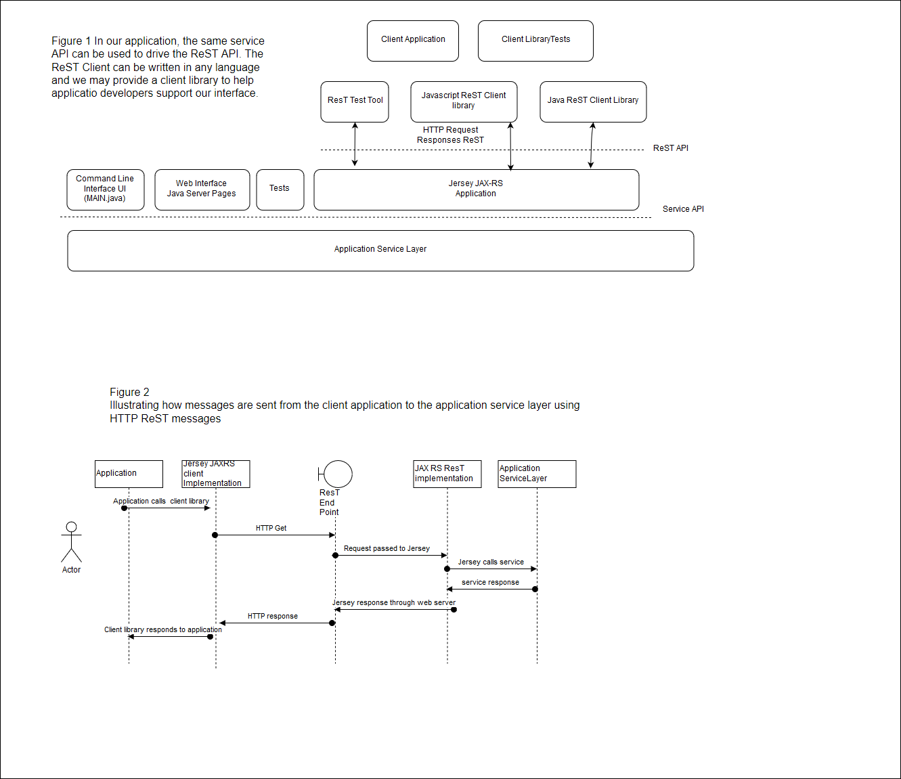
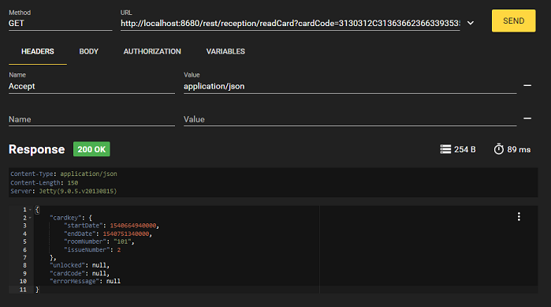
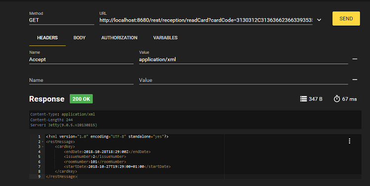

# Week 6 - Creating a ReST service using JAX-WS, JAXB, Jackson and Jersey  

Last week we saw how to set up a web application server (Jetty) and how to create a web application Java Server Pages connected to our service objects. 
This week we will extend our web application to enable it to support a ReST api using XML or Json messaging. 

## Web Services 

Web Services are API's implemented using HTTP which are intended for machine to machine communications. 

Representational State Transfer [ReST](https://en.wikipedia.org/wiki/Representational_state_transfer)  is a style of web service interface which uses HTTP Get, Post and Update operations to implement an API which transfers messages about resource objects using either XML or Json payloads.

Strictly  speaking most ReST interfaces (and indeed the ones we will make) do not completely following the ReST pattern for describing resources but they do use the HTTP commands with XML or Json messages.
The advantage of the ReST style is that is is relatively simple to implement and test and it will work through most firewalls.

The following diagram illustrates how we can extend our web application server to offer web services to stand alone clients.




## ReST and the Jersey library

Java provides a standard for implementing ReST interfaces called [JSR-339 JavaTM API for RESTful Web Services or more simply JAX-RS](https://download.oracle.com/otndocs/jcp/jaxrs-2_0-fr-eval-spec/index.html)
The most commonly used reference implementation of JAX-RS is [Jersey](https://jersey.github.io/) and we will use this library in our examples.

Lots of tutorials are available on line both on Jersey and ReST; for example see [Vogella's Jersey tutorial](http://www.vogella.com/tutorials/REST/article.html).
However as usual, we only need a subset of the standard to do what we need to do and the examples we will use are sufficient for you to understand what is going on. 

## JAXB and Jackson

XML is a standard for passing or saving information between systems as a machine readable documents. 
XML is very like HTML but has a much more precise definition. 
Since our ReST messages are going to be in XML, we need a library which can convert java objects into XML (called marshalling) or convert XML documents into java objects (called unmarshalling). 

The standard for manipulating XML in Java is called the Java Architecture for XML Binding or [JAXB](https://docs.oracle.com/javase/8/docs/technotes/guides/xml/jaxb/index.html).
JAXB is included with the JDK and is used by Jersey to create messages for ReST services. 

In addition to JAXB, if we include the Jackson library on our class path it allows Jersey to also marshal and unmarshal JAXB XML objects as Json messages.


# Exercises

## Getting Started
As always, first merge my upstream repository with your working repo.

This weeks work builds off the work we did last week on the hotellock project and you will have to merge my new changes with the work you did last week.

To make this easier, I suggest you make a week6 folder in your myPracticeCourseWork folder.
 
Then copy YOUR myPracticeCourseWork/week5/hotellock-parent and it's sub projects into myPracticeCourseWork/week6.

Then make the following changes to your copy of hotellock-parent based upon my enhanced version in week6/hotellock-parent.

1. replace the lock-model module with my new lock-model
2. replace the lock-uml with my new lock-uml
3. replace the lock-web with my new lock-web
4. copy your enhanced DoorLockPage.jsp and ReceptionPage.jsp files into the lock-web project

This will retain any tests and enhancements you made to lock-reception and lock-roomlock.

Now build the whole hotellock-parent project using 
```
mvn clean install
```
and import it into netbeans as previously

Check the project works as expected using mvn jetty:run etc in lock-web

## Exercise 1 JAXB

Look at the changed lock-uml project.

You will see that the class diagram has an extra interface; ServiceFactory and an extra class; RestMessage

These two artefacts now also have their equivalent generated java classes and interfaces in lock-model.

We will consider the ServiceFactory in a bit.

In our model we now have our original entity class CardKey.java and a new class, RestMessage.java which will be used to return results from a ReST call to our web application.

look at CardKey.java and you will see that it now has a new java annotation
```
import javax.xml.bind.annotation.XmlRootElement;

@XmlRootElement
public class CardKey {
...
}
```
JAXB uses these annotations to identify classes which can be marshalled into XML objects.
JAXB provides many annotations to modify the generated XML but we will only use this one.

Look at RestMessage.java.

You will see that it too has the JAXB annotation and has four fields;
```
@XmlRootElement
public class RestMessage {

    private CardKey cardkey = null;

    private Boolean unlocked = null;

    private String cardCode = null;

    private String errorMessage = null;

... getters and setters
}
```
The RestMessage object is an example of a Data Transfer Object - i.e. an object which is used to transfer information across an interface.

This same RestMessage object can be used as a return object for all of our ReST services.

It can contain 
* a cardCode string for when we ask the reception service to generate a card, 
* a cardKey object if we ask the reception service to decode a  door lock and
* an 'unlocked' boolean for the door lock service.

Notice that the RestMessage also contains an errorMessage string which will be populated with debug information if any operation fails.

Let's now consider how JAXB converts annotated objects into XML

look at the ModelJaxbTest.java test class under Test Packages.
This test populates a RestMessage, converts it into an XML file and then reads the xml file back into a RestMessage object.
The key lines are;
```
     JAXBContext jaxbContext = JAXBContext.newInstance("solent.ac.uk.ood.examples.hotellock.model");

     Marshaller jaxbMarshaller = jaxbContext.createMarshaller();

     RestMessage restMessage = new RestMessage(); // ... populate message
    
     jaxbMarshaller.marshal(restMessage, file);

     Unmarshaller jaxbUnMarshaller = jaxbContext.createUnmarshaller();
     RestMessage receivedRestMessage = (RestMessage) jaxbUnMarshaller.unmarshal(file);

```
The JAXBContext keeps track of all of the JAXB annotated objects we want to use.
Notice how a new context is created by giving it one (or more) packages to search for JAXB objects.

However annotating the objects is not enough. 
JAXB also needs to be given a hint by creating a jaxb.index file within the same source package.

To package this file properly, maven requires it is placed in the correct corresponding class path in the src/main/resources folder

The jaxb.index simply lists the JAXB annotated classes in the package.
```
RestMessage
CardKey

```
( As an aside, JAXB often uses an ObjectFactory class within the package instead of  jaxb.index file but this is beyond the scope of the current lesson)

Once we have created he JAXBContext, we can use this to create both Marshaller and Unmarshaller objects.

Run the test and you will see it populates and reads a simple xml file in target/testData.xml
```
<?xml version="1.0" encoding="UTF-8" standalone="yes"?>
<restMessage>
    <cardCode>10101010101010101010</cardCode>
    <cardkey>
        <endDate>2018-10-27T17:56:12.005+01:00</endDate>
        <issueNumber>1</issueNumber>
        <roomNumber>101</roomNumber>
        <startDate>2018-10-27T17:56:12.005+01:00</startDate>
    </cardkey>
    <unlocked>false</unlocked>
</restMessage>
```

JAXB is used by JAXRS in the Jersey library to create XML messages to send across HTTP.

JAXB can also be used to persist data to XML files for later reading and can thus be used as the basis for a simple 'Data Access Object' without needing a database.

You should make sure you understand how we annotated the objects in our model so that they could be used with JAXB.

Exercise 2 Run the ReST interface

First build the parent hotellock-parent parent project then cd to lock-web and run
```
mvn jetty:run
```

Access the reception Rest Interface using the following calls

To create a card

http://localhost:8680/rest/reception/createCardCode?roomNumber=101&requestStartDateStr=27/10/18+16:00&requestEndDateStr=28/10/18+15:00

To read a card

http://localhost:8680/rest/reception/readCard?cardCode=3130312C31363662366339353565302C31363662626566623165302C323A6239353539396632

In both cases you will see an XML response message which is based upon a partly populated RestMessage object.

If you are able, you can do more experiments by installing the Firefox RESTer plugin
https://addons.mozilla.org/en-US/firefox/addon/rester/

RESTer allows you to change the request headers to change between an XML response or JSON reponse;







