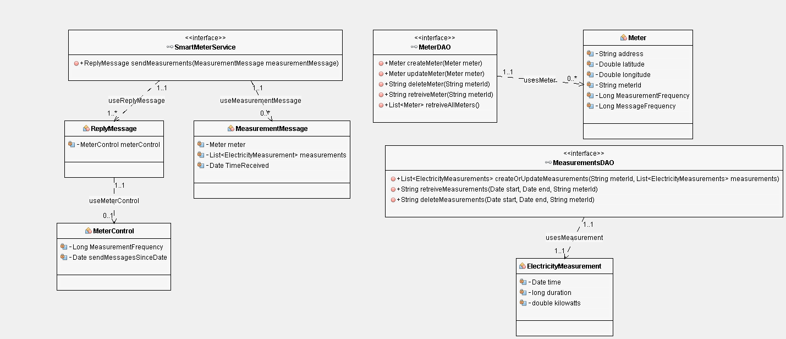

# Smart Meter System

Every home in the UK will be fitted with a smart meter which can measure electricity usage in Kilowatt Hours. 

The meters will measure average power consumption regularly many times per day with a  measurement duration between each measurement.
The measurement duration (in ms) can be set by the smart meter service. 
Usually this is every 15 minutes.

A Kilowatt  is a measure of how much power is being used at an instance of time. 

A Kilowatt Hour is a measure of how much power has been used during an hour

These smart meters will send measurements using a ReST interfaces to a smart meter service.

Each meter will send its collection of messages since the last message every 'message duration' interval.
Usually messages are sent once a day but on failure to communicate this will be retried until the message is sent successfully.

Because the smart meters will communicate from behind a firewall, they cannot be contacted directly.
Thus any control messages (setting message duration or measurement interval) must be sent to the smart meters as a reply to a message received by the smart meter service

The smart meter service saves all measurements received from each smart meter

The Kilowatt Hours usage is calculated using Kilowatt consumption * duration

Smart meters will each have a unique smart meterID, address, latitude and longitude.
The mart meters will be configurable to measure kilowatt used in each interval

Create a use case and UML class diagram to describe the system

## class diagram

